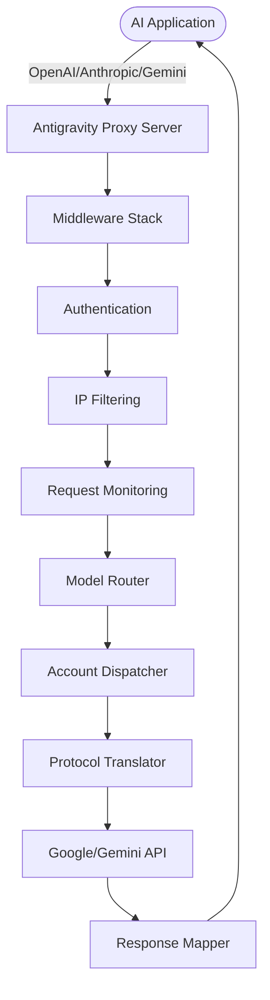

## Introduction

Antigravity Manager provides a powerful proxy server that translates multiple AI protocol formats into Google's Gemini API, enabling seamless integration with various AI tools and frameworks.

## Supported Protocol Formats

The API supports three major protocol formats, allowing you to use Antigravity Manager as a drop-in replacement for:

### 1. OpenAI Protocol

Compatible with 99% of existing AI applications that use the OpenAI API format.

**Base URL**: `http://127.0.0.1:8045/v1`

**Supported Endpoints**:
- `/v1/models` - List available models
- `/v1/chat/completions` - Chat completions (streaming & non-streaming)
- `/v1/completions` - Text completions
- `/v1/responses` - Codex CLI compatibility
- `/v1/images/generations` - Image generation (Imagen 3)
- `/v1/images/edits` - Image editing
- `/v1/audio/transcriptions` - Audio transcription

**Example Request**:
```python
import openai

client = openai.OpenAI(
    api_key="sk-antigravity",
    base_url="http://127.0.0.1:8045/v1"
)

response = client.chat.completions.create(
    model="gemini-3-flash",
    messages=[{"role": "user", "content": "Hello!"}]
)
print(response.choices[0].message.content)
```

### 2. Anthropic Protocol

Native support for Claude API format, including full Claude Code CLI functionality.

**Base URL**: `http://127.0.0.1:8045`

**Supported Endpoints**:
- `/v1/messages` - Claude messages API
- `/v1/messages/count_tokens` - Token counting
- `/v1/models/claude` - List Claude-compatible models

**Features**:
- System prompts
- Thinking mode (chain-of-thought)
- Tool use and function calling
- Vision and multimodal inputs

**Example Request**:
```bash
curl -X POST http://127.0.0.1:8045/v1/messages \
  -H "Content-Type: application/json" \
  -H "x-api-key: sk-antigravity" \
  -d '{
    "model": "claude-sonnet-4-6",
    "max_tokens": 1024,
    "messages": [
      {"role": "user", "content": "Explain quantum computing"}
    ]
  }'
```

### 3. Gemini Protocol

Direct access to Google's native Gemini API format.

**Base URL**: `http://127.0.0.1:8045`

**Supported Endpoints**:
- `/v1beta/models` - List available models
- `/v1beta/models/{model}` - Get model info or generate content
- `/v1beta/models/{model}/countTokens` - Count tokens

**Example Request**:
```bash
curl -X POST http://127.0.0.1:8045/v1beta/models/gemini-3.1-pro:generateContent \
  -H "Content-Type: application/json" \
  -H "x-goog-api-key: sk-antigravity" \
  -d '{
    "contents": [{
      "parts": [{"text": "Write a haiku about AI"}]
    }]
  }'
```

## API Architecture



## Default Configuration

| Setting | Default Value | Description |
|---------|---------------|-------------|
| **Port** | `8045` | HTTP server listening port |
| **Host** | `127.0.0.1` | Localhost only (can be changed to `0.0.0.0` for LAN) |
| **Max Body Size** | `100 MB` | Maximum request payload size |
| **Request Timeout** | `300s` | API request timeout (5 minutes) |
| **Auth Mode** | `Auto` | Automatic authentication mode |

## Environment Variables

You can customize the server behavior using these environment variables:

```bash
# Maximum request body size (in bytes)
export ABV_MAX_BODY_SIZE=104857600  # 100MB

# Static file directory for headless mode
export ABV_DIST_PATH="dist"

# API authentication key
export API_KEY="sk-antigravity"

# Web UI admin password (optional)
export WEB_PASSWORD="your-admin-password"
```

## Health Check

The API provides health check endpoints for monitoring:

**Endpoints**:
- `GET /health`
- `GET /healthz`

**Response**:
```json
{
  "status": "ok",
  "version": "4.1.27"
}
```

## Protocol Translation

Antigravity Manager automatically translates between different protocol formats:

### Request Flow

1. **Client Request** → Incoming request in OpenAI/Anthropic/Gemini format
2. **Authentication** → Validates API key or user token
3. **Model Mapping** → Maps requested model to internal Gemini model
4. **Protocol Translation** → Converts request to Gemini format
5. **Account Selection** → Chooses optimal Google account based on quota
6. **Upstream Request** → Forwards to Google Gemini API
7. **Response Translation** → Converts response back to requested format
8. **Client Response** → Returns in original protocol format

### Smart Features

- **Automatic Retry**: Handles `429` and `401` errors with silent account rotation
- **Quota Management**: Tracks and respects per-model usage limits
- **Session Binding**: Maintains consistency across multi-turn conversations
- **Thinking Mode**: Supports chain-of-thought reasoning across all protocols
- **Multimodal Support**: Handles text, images, and audio inputs

## Rate Limits

Rate limiting is handled transparently:

- When an account hits quota limits, the system automatically switches to another available account
- No interruption to client requests
- Quota status is tracked in real-time and refreshed periodically

## Error Handling

Standard HTTP status codes are returned:

| Status Code | Description |
|-------------|-------------|
| `200` | Success |
| `400` | Bad request (invalid parameters) |
| `401` | Unauthorized (missing or invalid API key) |
| `403` | Forbidden (quota exceeded or blocked) |
| `404` | Not found (invalid endpoint or model) |
| `429` | Too many requests (rate limit exceeded) |
| `500` | Internal server error |

## Next Steps

<CardGroup cols={2}>
  <Card title="Authentication" icon="lock" href="/api/authentication">
    Learn how to authenticate API requests
  </Card>
  <Card title="Model Routing" icon="route" href="/configure/model-routing">
    Configure model mappings and routing
  </Card>
</CardGroup>
