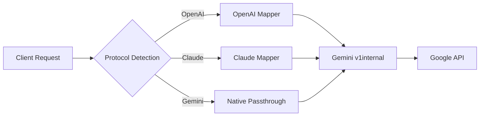

# Request Mapping

Antigravity Manager acts as a universal protocol translator, converting requests from OpenAI and Claude formats into Gemini's native v1internal format. This enables seamless integration with AI clients while leveraging Google's powerful models.

## Architecture Overview



## OpenAI to Gemini Conversion

Location: `src-tauri/src/proxy/mappers/openai/request.rs`

### Message Transformation

OpenAI messages are converted to Gemini's contents format with role mapping:

```rust
let role = match msg.role.as_str() {
    "assistant" => "model",
    "tool" | "function" => "user", 
    _ => &msg.role,
};
```

**Role Mapping:**
- `assistant` → `model`
- `user` → `user`
- `tool`/`function` → `user` (tool results are user messages)
- `system`/`developer` → Extracted to `systemInstruction`

### System Instructions

System messages are extracted and combined with:
1. **Antigravity Identity** (if not already present)
2. **Global System Prompt** (if configured)
3. **User-provided system messages**

```json
{
  "systemInstruction": {
    "role": "user",
    "parts": [
      {"text": "You are Antigravity, a powerful agentic AI coding assistant..."},
      {"text": "<Global System Prompt>"},
      {"text": "<User System Message>"}
    ]
  }
}
```

### Tool Calls Conversion

OpenAI tool calls are transformed into Gemini's functionCall format:

**OpenAI Format:**
```json
{
  "tool_calls": [{
    "id": "call_123",
    "type": "function",
    "function": {
      "name": "read_file",
      "arguments": "{\"path\":\"/file.txt\"}"
    }
  }]
}
```

**Gemini Format:**
```json
{
  "parts": [{
    "functionCall": {
      "name": "read_file",
      "args": {"path": "/file.txt"},
      "id": "call_123"
    }
  }]
}
```

### Thinking Mode Support

For thinking models (containing `-thinking` or `pro` variants):

```json
{
  "generationConfig": {
    "thinkingConfig": {
      "includeThoughts": true,
      "thinkingBudget": 24576
    }
  }
}
```

**Budget Configuration:**
- **Passthrough Mode**: Uses user-specified budget
- **Custom Mode**: Uses configured budget (capped at model limit)
- **Auto Mode**: Uses model-specific default (24576 for Gemini Pro)
- **Adaptive Mode**: Dynamic based on request complexity

### Multimodal Content

Image URLs are converted to inline data:

```javascript
// Data URL
"data:image/png;base64,iVBORw0..."
↓
{
  "inlineData": {
    "mimeType": "image/png",
    "data": "iVBORw0..."
  }
}

// HTTP URL
"https://example.com/image.png"
↓
{
  "fileData": {
    "fileUri": "https://example.com/image.png",
    "mimeType": "image/jpeg"
  }
}

// Local File (file:///path/to/image.png)
↓
{
  "inlineData": {
    "mimeType": "image/png",
    "data": "<base64_encoded_file>"
  }
}
```

### Generation Config Mapping

| OpenAI Parameter | Gemini Parameter | Notes |
|-----------------|------------------|-------|
| `temperature` | `temperature` | Direct mapping (default: 1.0) |
| `top_p` | `topP` | Direct mapping (default: 1.0) |
| N/A | `topK` | Fixed at 40 (official client alignment) |
| `max_tokens` | `maxOutputTokens` | Dynamic limit from model specs |
| `n` | `candidateCount` | Multiple response support |
| `stop` | `stopSequences` | Converted to array if string |
| `response_format` | `responseMimeType` | JSON mode support |

## Claude to Gemini Conversion

Location: `src-tauri/src/proxy/mappers/claude/request.rs`

### Message Structure

Claude's message format is more complex, supporting thinking blocks:

```json
{
  "role": "assistant",
  "content": [
    {"type": "thinking", "thinking": "Let me analyze...", "signature": "<sig>"},
    {"type": "text", "text": "The answer is..."},
    {"type": "tool_use", "id": "call_1", "name": "search", "input": {}}
  ]
}
```

**Converted to Gemini:**
```json
{
  "role": "model",
  "parts": [
    {"text": "Let me analyze...", "thought": true, "thoughtSignature": "<sig>"},
    {"text": "The answer is..."},
    {"functionCall": {"name": "search", "args": {}, "id": "call_1"}}
  ]
}
```

### Block Ordering

Claude requires strict block ordering: **Thinking → Text → Tool Use**

The mapper enforces this with triple-stage partitioning (see `src-tauri/src/proxy/mappers/claude/request.rs:178-252`).

### Signature Management

Thinking blocks require signatures for validation:

1. **Client-provided signature** (highest priority)
2. **Context signature** (from previous messages)
3. **Session cache** (conversation-level)
4. **Tool cache** (tool-specific)
5. **Global store** (deprecated, for compatibility)

Signatures are validated for:
- Minimum length (50 characters)
- Model compatibility (family matching)
- Not from retry attempts

### Cache Control Cleanup

Claude clients may send `cache_control` fields from history:

```typescript
function clean_cache_control_from_messages(messages: Message[]) {
  // Recursively removes cache_control from:
  // - Thinking blocks
  // - Image blocks  
  // - Document blocks
  // - Tool use blocks
}
```

This prevents "Extra inputs are not permitted" errors.

### Tool Schema Conversion

Claude tool schemas are converted to Gemini's uppercase type format:

```json
// Claude format
{
  "name": "search",
  "input_schema": {
    "type": "object",
    "properties": {
      "query": {"type": "string"}
    }
  }
}

// Gemini format
{
  "name": "search",
  "parameters": {
    "type": "OBJECT",
    "properties": {
      "query": {"type": "STRING"}
    }
  }
}
```

Invalid fields are cleaned:
- `format` (JSON Schema validation)
- `strict` (OpenAI-specific)
- `additionalProperties`
- `definitions` / `$ref` (expanded inline)

## Image Generation

Both protocols support image generation through `gemini-3-pro-image` models.

### Size Parameter Mapping

```javascript
// Method 1: Explicit size parameter
{
  "model": "gemini-3-pro-image",
  "size": "1920x1080",
  "quality": "hd"
}
↓
{
  "generationConfig": {
    "imageConfig": {
      "aspectRatio": "16:9",
      "imageSize": "4K"
    }
  }
}

// Method 2: Model suffix
{
  "model": "gemini-3-pro-image-16-9-4k"
}
↓ (same result)

// Method 3: imageSize parameter (highest priority)
{
  "model": "gemini-3-pro-image",
  "imageSize": "4K"
}
```

**Priority:** `imageSize` > `size` + `quality` > model suffix

### Quality Mapping

| Quality | Image Size | Resolution |
|---------|-----------|------------|
| `standard` | `1K` | Default |
| `medium` | `2K` | Mid-range |
| `hd` | `4K` | High quality |

### Aspect Ratio Auto-Detection

WxH format is automatically converted:

```javascript
"1920x1080" → "16:9"
"1024x1024" → "1:1"
"1280x720" → "16:9"
"1080x1920" → "9:16"
```

## Request Enhancement

### Session ID Injection

All requests include a stable session ID:

```json
{
  "sessionId": "<derived_from_account_id>",
  "requestId": "agent/antigravity/<session_prefix>/<turn_number>"
}
```

### Safety Settings

All filters are disabled by default for proxy compatibility:

```json
{
  "safetySettings": [
    {"category": "HARM_CATEGORY_HARASSMENT", "threshold": "OFF"},
    {"category": "HARM_CATEGORY_HATE_SPEECH", "threshold": "OFF"},
    {"category": "HARM_CATEGORY_SEXUALLY_EXPLICIT", "threshold": "OFF"},
    {"category": "HARM_CATEGORY_DANGEROUS_CONTENT", "threshold": "OFF"},
    {"category": "HARM_CATEGORY_CIVIC_INTEGRITY", "threshold": "OFF"}
  ]
}
```

Configurable via `GEMINI_SAFETY_THRESHOLD` environment variable.

### Tool Config

Forces validated tool calling mode:

```json
{
  "toolConfig": {
    "functionCallingConfig": {
      "mode": "VALIDATED"
    }
  }
}
```

## Common Utilities

Location: `src-tauri/src/proxy/mappers/common_utils.rs`

### Google Search Injection

When web search is detected or requested:

```rust
fn inject_google_search_tool(request: &mut Value) {
    request["tools"] = json!([
        {"googleSearch": {}}
    ]);
}
```

### Undefined Cleanup

Recursively removes `[undefined]` strings from Cherry Studio and other clients:

```rust
fn deep_clean_undefined(value: &mut Value, depth: usize) {
    // Replaces "[undefined]" with empty string
    // Prevents "INVALID_ARGUMENT" errors
}
```

### JSON Schema Fixes

Common corrections:
- Convert `paths` (array) → `path` (string) for tools
- Fix parameter types (string vs number)
- Remove validation keywords (`format`, `pattern`)
- Expand `$ref` definitions

## Error Handling

Request mapping can fail with:

- **Empty tool names** → Skipped
- **Invalid signatures** → Downgraded to text
- **Incompatible thinking history** → Thinking disabled
- **Missing required fields** → Auto-injected defaults

## See Also

- [Response Mapping](/api/response-mapping) - Converting Gemini responses back
- [Streaming](/api/streaming) - SSE event transformation
- [Error Handling](/api/error-handling) - Retry logic and self-healing
