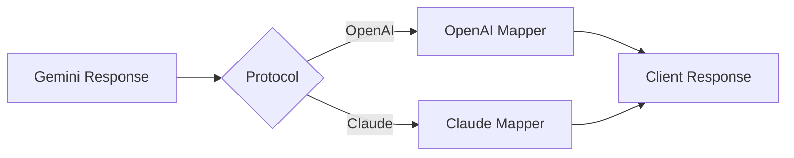

# Response Mapping

After sending requests to Google's Gemini API, Antigravity transforms the responses back into the original protocol format expected by the client.

## Architecture



## Gemini to OpenAI Conversion

Location: `src-tauri/src/proxy/mappers/openai/response.rs`

### Basic Structure

**Gemini Response:**
```json
{
  "response": {
    "candidates": [{
      "content": {
        "parts": [
          {"text": "Hello!", "thought": false},
          {"text": "Let me think...", "thought": true, "thoughtSignature": "sig123"}
        ]
      },
      "finishReason": "STOP"
    }],
    "usageMetadata": {
      "promptTokenCount": 100,
      "candidatesTokenCount": 50,
      "totalTokenCount": 150
    },
    "modelVersion": "gemini-2.0-flash-thinking",
    "responseId": "resp_abc123"
  }
}
```

**OpenAI Response:**
```json
{
  "id": "resp_abc123",
  "object": "chat.completion",
  "created": 1709472000,
  "model": "gemini-2.0-flash-thinking",
  "choices": [{
    "index": 0,
    "message": {
      "role": "assistant",
      "content": "Hello!",
      "reasoning_content": "Let me think..."
    },
    "finish_reason": "stop"
  }],
  "usage": {
    "prompt_tokens": 100,
    "completion_tokens": 50,
    "total_tokens": 150
  }
}
```

### Content Extraction

The mapper processes each part:

```rust
for part in parts {
    let is_thought = part.get("thought").and_then(|v| v.as_bool()).unwrap_or(false);
    
    if let Some(text) = part.get("text").and_then(|t| t.as_str()) {
        if is_thought {
            thought_out.push_str(text);  // reasoning_content
        } else {
            content_out.push_str(text);  // content
        }
    }
    
    // Capture signature for next request
    if let Some(sig) = part.get("thoughtSignature").and_then(|s| s.as_str()) {
        store_thought_signature(sig, session_id, message_count);
    }
}
```

### Thinking Content Separation

Thinking models output two content streams:

1. **`content`**: Final answer visible to user
2. **`reasoning_content`**: Internal reasoning process

This is extracted using the `thought: true` flag on parts.

### Tool Calls Conversion

**Gemini Format:**
```json
{
  "functionCall": {
    "name": "read_file",
    "args": {"path": "/file.txt"},
    "id": "call_123"
  }
}
```

**OpenAI Format:**
```json
{
  "tool_calls": [{
    "id": "call_123",
    "type": "function",
    "function": {
      "name": "read_file",
      "arguments": "{\"path\":\"/file.txt\"}"
    }
  }]
}
```

Note: Arguments are re-serialized to JSON string.

### Image Responses

Inline images are converted to markdown:

```rust
if let Some(img) = part.get("inlineData") {
    let mime_type = img.get("mimeType").and_then(|v| v.as_str()).unwrap_or("image/png");
    let data = img.get("data").and_then(|v| v.as_str()).unwrap_or("");
    
    content_out.push_str(&format!("", mime_type, data));
}
```

### Grounding Metadata (Web Search)

Search results are appended as markdown:

```rust
if let Some(grounding) = candidate.get("groundingMetadata") {
    // Extract search query
    if let Some(queries) = grounding.get("webSearchQueries") {
        content_out.push_str("\n\n---\n**🔍 已为您搜索：** ");
        content_out.push_str(&query_list.join(", "));
    }
    
    // Extract source links
    if let Some(chunks) = grounding.get("groundingChunks") {
        content_out.push_str("\n\n**🌐 来源引文：**\n");
        for (i, chunk) in chunks.iter().enumerate() {
            let title = chunk["web"]["title"].as_str().unwrap_or("网页来源");
            let uri = chunk["web"]["uri"].as_str().unwrap_or("#");
            links.push(format!("[{}] [{}]({})", i + 1, title, uri));
        }
    }
}
```

### Finish Reason Mapping

| Gemini Reason | OpenAI Reason | Description |
|--------------|---------------|-------------|
| `STOP` | `stop` | Natural completion |
| `MAX_TOKENS` | `length` | Token limit reached |
| `SAFETY` | `content_filter` | Safety violation |
| `RECITATION` | `content_filter` | Copyright detection |
| Tool call present | `tool_calls` | Function called |

### Usage Metadata Mapping

```rust
OpenAIUsage {
    prompt_tokens: u.get("promptTokenCount").unwrap_or(0),
    completion_tokens: u.get("candidatesTokenCount").unwrap_or(0),
    total_tokens: u.get("totalTokenCount").unwrap_or(0),
    prompt_tokens_details: Some(PromptTokensDetails {
        cached_tokens: u.get("cachedContentTokenCount")
    }),
    completion_tokens_details: None
}
```

## Gemini to Claude Conversion

Location: `src-tauri/src/proxy/mappers/claude/streaming.rs` (non-streaming uses similar logic)

### Message Structure

Claude expects a structured message with content blocks:

```json
{
  "id": "msg_123",
  "type": "message",
  "role": "assistant",
  "content": [
    {
      "type": "thinking",
      "thinking": "Let me analyze...",
      "signature": "sig_abc"
    },
    {
      "type": "text",
      "text": "The answer is..."
    },
    {
      "type": "tool_use",
      "id": "call_1",
      "name": "search",
      "input": {"query": "test"}
    }
  ],
  "stop_reason": "tool_use",
  "usage": {
    "input_tokens": 100,
    "output_tokens": 50
  }
}
```

### Content Block Types

**1. Thinking Block**
```json
{
  "type": "thinking",
  "thinking": "<reasoning_text>",
  "signature": "<thought_signature>"
}
```

**2. Text Block**
```json
{
  "type": "text",
  "text": "<response_text>"
}
```

**3. Tool Use Block**
```json
{
  "type": "tool_use",
  "id": "<call_id>",
  "name": "<tool_name>",
  "input": {<tool_args>}
}
```

### Stop Reason Logic

```rust
let stop_reason = if self.used_tool {
    "tool_use"
} else if finish_reason == Some("MAX_TOKENS") {
    "max_tokens"
} else {
    "end_turn"
};
```

### Usage Conversion

Claude format includes cache information:

```rust
Usage {
    input_tokens: prompt_tokens,
    output_tokens: completion_tokens,
    cache_read_input_tokens: Some(cached_tokens),
    cache_creation_input_tokens: None,
    server_tool_use: None
}
```

### Context Scaling

For large context windows (>1M tokens), usage can be scaled:

```rust
if scaling_enabled && context_limit > 1_000_000 {
    let scale = context_limit as f64 / 1_000_000.0;
    input_tokens = (input_tokens as f64 * scale) as u32;
}
```

This helps calibrate token estimation for ultra-long contexts.

## Multi-Candidate Support

Both protocols support multiple response candidates (OpenAI's `n` parameter):

```rust
for (idx, candidate) in candidates.iter().enumerate() {
    choices.push(Choice {
        index: idx as u32,
        message: /* ... */,
        finish_reason: /* ... */
    });
}
```

Each candidate becomes a separate choice in the response.

## Image Generation Responses

For image models:

**Gemini:**
```json
{
  "candidates": [{
    "content": {
      "parts": [{
        "inlineData": {
          "mimeType": "image/png",
          "data": "iVBORw0KGgoAAAANSUhEUgAA..."
        }
      }]
    }
  }]
}
```

**OpenAI:**
```json
{
  "data": [{
    "url": "data:image/png;base64,iVBORw0KGgoAAAANSUhEUgAA...",
    "b64_json": "iVBORw0KGgoAAAANSUhEUgAA..."
  }]
}
```

**Claude:**
```markdown

```

## Signature Caching

Thought signatures are automatically cached for future requests:

```rust
pub fn store_thought_signature(sig: &str, session_id: &str, message_count: usize) {
    // 1. Session-isolated cache (highest priority)
    SignatureCache::global().cache_session_signature(
        session_id, 
        sig.to_string(), 
        message_count
    );
    
    // 2. Tool-specific cache (for recovery)
    SignatureCache::global().cache_tool_signature(tool_id, sig.clone());
    
    // 3. Family cache (model compatibility)
    SignatureCache::global().cache_thinking_family(sig.clone(), model.clone());
}
```

This enables:
- **Conversation continuity** - Signatures persist across turns
- **Retry recovery** - Failed requests can reuse signatures
- **Tool loop support** - Function calls maintain signature context

## Response Validation

Before returning responses, the mapper validates:

1. **Required fields present** (id, object, choices)
2. **At least one choice** exists
3. **Valid finish reason** for completed responses
4. **Usage data** matches actual tokens (when available)

## Error Responses

When upstream errors occur:

**OpenAI Format:**
```json
{
  "error": {
    "message": "Rate limit exceeded",
    "type": "rate_limit_error",
    "code": "rate_limit_exceeded"
  }
}
```

**Claude Format:**
```json
{
  "type": "error",
  "error": {
    "type": "rate_limit_error",
    "message": "Rate limit exceeded"
  }
}
```

See [Error Handling](/api/error-handling) for retry logic.

## Performance Optimizations

### Zero-Copy Deserialization

Responses use `serde_json::from_str` with borrowed strings to avoid allocations:

```rust
let json: &Value = &actual_data;  // Borrow, don't clone
if let Some(parts) = json.get("candidates")[0]["content"]["parts"].as_array() {
    // Process without copying
}
```

### Lazy Evaluation

Usage metadata is only extracted when needed:

```rust
let usage = raw.get("usageMetadata").and_then(|u| {
    // Only parsed if present
    extract_usage_metadata(u)
});
```

### String Pooling

Common strings are reused:

```rust
const ROLE_ASSISTANT: &str = "assistant";
const FINISH_STOP: &str = "stop";
```

## See Also

- [Request Mapping](/api/request-mapping) - Converting requests to Gemini
- [Streaming](/api/streaming) - Real-time SSE transformation
- [Error Handling](/api/error-handling) - Self-healing and retry
