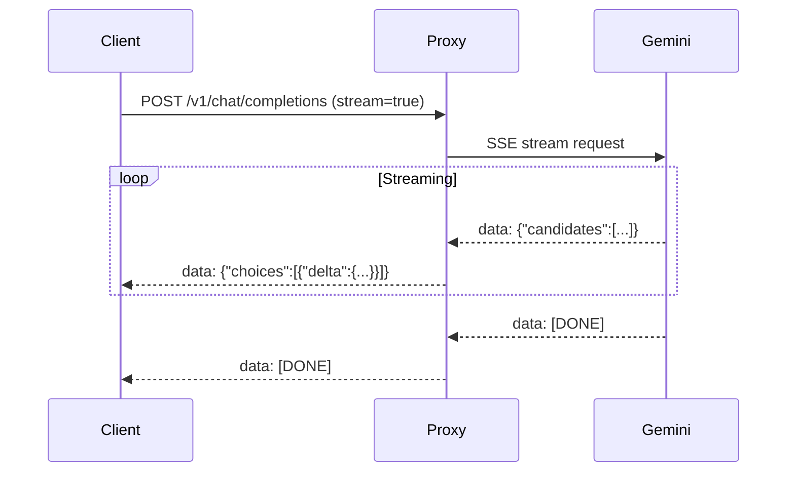

# SSE Streaming Responses

Antigravity Manager converts Gemini's streaming responses into OpenAI and Claude SSE (Server-Sent Events) formats, enabling real-time token-by-token output.

## Architecture



## OpenAI SSE Format

Location: `src-tauri/src/proxy/mappers/openai/streaming.rs`

### Event Sequence

1. **Initial chunk** with role:
```
data: {"id":"chatcmpl-abc","object":"chat.completion.chunk","created":1709472000,"model":"gemini-2.0-flash","choices":[{"index":0,"delta":{"role":"assistant"},"finish_reason":null}]}

```

2. **Content chunks** as they arrive:
```
data: {"id":"chatcmpl-abc","object":"chat.completion.chunk","created":1709472000,"model":"gemini-2.0-flash","choices":[{"index":0,"delta":{"content":"Hello"},"finish_reason":null}]}

data: {"id":"chatcmpl-abc","object":"chat.completion.chunk","created":1709472000,"model":"gemini-2.0-flash","choices":[{"index":0,"delta":{"content":" world"},"finish_reason":null}]}

```

3. **Reasoning chunks** (for thinking models):
```
data: {"id":"chatcmpl-abc","object":"chat.completion.chunk","created":1709472000,"model":"gemini-2.0-flash-thinking","choices":[{"index":0,"delta":{"reasoning_content":"Let me think..."},"finish_reason":null}]}

```

4. **Tool call chunks**:
```
data: {"id":"chatcmpl-abc","object":"chat.completion.chunk","created":1709472000,"model":"gemini-2.0-flash","choices":[{"index":0,"delta":{"tool_calls":[{"index":0,"id":"call_123","type":"function","function":{"name":"search","arguments":"{\"query\":\"test\"}"}}]},"finish_reason":null}]}

```

5. **Final chunk** with usage:
```
data: {"id":"chatcmpl-abc","object":"chat.completion.chunk","created":1709472000,"model":"gemini-2.0-flash","choices":[{"index":0,"delta":{},"finish_reason":"stop"}],"usage":{"prompt_tokens":100,"completion_tokens":50,"total_tokens":150}}

data: [DONE]

```

### Streaming State Machine

The mapper maintains state across chunks:

```rust
let mut emitted_tool_calls = HashSet::new();  // Prevent duplicates
let mut final_usage: Option<OpenAIUsage> = None;
let mut tool_call_index = 0;

loop {
    tokio::select! {
        item = gemini_stream.next() => {
            match item {
                Some(Ok(bytes)) => {
                    buffer.extend_from_slice(&bytes);
                    // Process line-by-line
                    while let Some(pos) = buffer.iter().position(|&b| b == b'\n') {
                        let line = buffer.split_to(pos + 1);
                        // Parse SSE event...
                    }
                }
            }
        }
        _ = heartbeat_interval.tick() => {
            yield Ok(Bytes::from(": ping\n\n"));  // Keep-alive
        }
    }
}
```

### Heartbeat Mechanism

To prevent connection timeouts, heartbeat pings are sent every 15 seconds:

```rust
let mut heartbeat_interval = tokio::time::interval(Duration::from_secs(15));
heartbeat_interval.set_missed_tick_behavior(MissedTickBehavior::Skip);

tokio::select! {
    _ = heartbeat_interval.tick() => {
        yield Ok::<Bytes, String>(Bytes::from(": ping\n\n"));
    }
}
```

This is an SSE comment (`:` prefix) that clients ignore but keeps the connection alive.

### Buffer Management

Incoming bytes are buffered and processed line-by-line:

```rust
let mut buffer = BytesMut::new();

buffer.extend_from_slice(&bytes);
while let Some(pos) = buffer.iter().position(|&b| b == b'\n') {
    let line_raw = buffer.split_to(pos + 1);
    if let Ok(line_str) = std::str::from_utf8(&line_raw) {
        let line = line_str.trim();
        if line.starts_with("data: ") {
            let json_part = line.trim_start_matches("data: ").trim();
            if json_part != "[DONE]" {
                // Parse and transform...
            }
        }
    }
}
```

This handles fragmented network packets correctly.

## Claude SSE Format

Location: `src-tauri/src/proxy/mappers/claude/streaming.rs`

Claude's streaming format is more complex with explicit content block lifecycle:

### Event Types

**1. message_start**
```
event: message_start
data: {"type":"message_start","message":{"id":"msg_123","type":"message","role":"assistant","content":[],"model":"gemini-2.0-flash","stop_reason":null,"usage":{"input_tokens":100,"output_tokens":0}}}

```

**2. content_block_start**
```
event: content_block_start
data: {"type":"content_block_start","index":0,"content_block":{"type":"text","text":""}}

```

**3. content_block_delta** (multiple)
```
event: content_block_delta
data: {"type":"content_block_delta","index":0,"delta":{"type":"text_delta","text":"Hello"}}

event: content_block_delta  
data: {"type":"content_block_delta","index":0,"delta":{"type":"text_delta","text":" world"}}

```

**4. content_block_stop**
```
event: content_block_stop
data: {"type":"content_block_stop","index":0}

```

**5. message_delta** (final)
```
event: message_delta
data: {"type":"message_delta","delta":{"stop_reason":"end_turn"},"usage":{"output_tokens":50}}

```

**6. message_stop**
```
event: message_stop
data: {"type":"message_stop"}

```

### Thinking Block Streaming

Thinking content gets separate blocks:

```
event: content_block_start
data: {"type":"content_block_start","index":0,"content_block":{"type":"thinking","thinking":""}}

event: content_block_delta
data: {"type":"content_block_delta","index":0,"delta":{"type":"thinking_delta","thinking":"Let me analyze..."}}

event: content_block_delta
data: {"type":"content_block_delta","index":0,"delta":{"type":"signature_delta","signature":"sig_abc123..."}}

event: content_block_stop
data: {"type":"content_block_stop","index":0}

```

Signatures are streamed separately to support validation.

### Tool Use Streaming

Tool calls are streamed differently than OpenAI:

**Block start with empty input:**
```
event: content_block_start
data: {"type":"content_block_start","index":1,"content_block":{"type":"tool_use","id":"call_123","name":"search","input":{}}}

```

**Input delta with full JSON:**
```
event: content_block_delta
data: {"type":"content_block_delta","index":1,"delta":{"type":"input_json_delta","partial_json":"{\"query\":\"test\"}"}}

```

**Block stop:**
```
event: content_block_stop
data: {"type":"content_block_stop","index":1}

```

### State Machine

```rust
pub struct StreamingState {
    block_type: BlockType,  // None, Text, Thinking, Function
    block_index: usize,
    message_start_sent: bool,
    message_stop_sent: bool,
    used_tool: bool,
    signatures: SignatureManager,
    trailing_signature: Option<String>,
    web_search_query: Option<String>,
    grounding_chunks: Option<Vec<Value>>,
}

impl StreamingState {
    pub fn start_block(&mut self, block_type: BlockType, content_block: Value) -> Vec<Bytes> {
        // Close previous block if any
        if self.block_type != BlockType::None {
            chunks.extend(self.end_block());
        }
        
        // Emit content_block_start
        chunks.push(self.emit("content_block_start", json!({
            "type": "content_block_start",
            "index": self.block_index,
            "content_block": content_block
        })));
        
        self.block_type = block_type;
        chunks
    }
    
    pub fn end_block(&mut self) -> Vec<Bytes> {
        // Emit content_block_stop
        // Increment block_index
        // Reset block_type
    }
}
```

### Signature Management

Signatures are buffered and emitted at block end:

```rust
pub struct SignatureManager {
    pending: Option<String>,
}

impl SignatureManager {
    pub fn store(&mut self, signature: Option<String>) {
        if signature.is_some() {
            self.pending = signature;
        }
    }
    
    pub fn consume(&mut self) -> Option<String> {
        self.pending.take()
    }
}

// In streaming loop:
if self.block_type == BlockType::Thinking && self.signatures.has_pending() {
    if let Some(signature) = self.signatures.consume() {
        chunks.push(self.emit_delta("signature_delta", json!({
            "signature": signature
        })));
    }
}
```

## Web Search Grounding

Search results are appended as markdown text blocks:

```rust
if self.web_search_query.is_some() || self.grounding_chunks.is_some() {
    let mut grounding_text = String::new();
    
    // Add search query
    if let Some(query) = &self.web_search_query {
        grounding_text.push_str("\n\n---\n**🔍 已为您搜索：** ");
        grounding_text.push_str(query);
    }
    
    // Add source links
    if let Some(chunks) = &self.grounding_chunks {
        grounding_text.push_str("\n\n**🌐 来源引文：**\n");
        for (i, chunk) in chunks.iter().enumerate() {
            let title = chunk["web"]["title"].as_str().unwrap_or("网页来源");
            let uri = chunk["web"]["uri"].as_str().unwrap_or("#");
            links.push(format!("[{}] [{}]({})", i + 1, title, uri));
        }
    }
    
    // Emit as new text block
    chunks.push(self.emit("content_block_start", json!({
        "type": "content_block_start",
        "index": self.block_index,
        "content_block": {"type": "text", "text": ""}
    })));
    chunks.push(self.emit_delta("text_delta", json!({"text": grounding_text})));
    chunks.push(self.emit("content_block_stop", json!({
        "type": "content_block_stop",
        "index": self.block_index
    })));
}
```

## Error Handling in Streams

When errors occur mid-stream:

**OpenAI:**
```
data: {"id":"chatcmpl-abc","object":"chat.completion.chunk","created":1709472000,"model":"gemini-2.0-flash","choices":[],"error":{"type":"overloaded_error","message":"网络连接不稳定，请检查您的网络或代理设置。","code":"stream_error"}}

data: [DONE]

```

**Claude:**
```
event: error
data: {"type":"error","error":{"type":"overloaded_error","message":"网络连接不稳定，请检查您的网络或代理设置。"}}

```

The stream is then terminated gracefully.

## MCP XML Bridge

For MCP tool calls, XML syntax is supported:

```xml
<mcp__puppeteer__navigate>{"url":"https://example.com"}</mcp__puppeteer__navigate>
```

This is automatically detected and converted:

```rust
if text.contains("<mcp__") || self.in_mcp_xml {
    self.in_mcp_xml = true;
    self.mcp_xml_buffer.push_str(text);
    
    if self.mcp_xml_buffer.contains("</mcp__") {
        // Extract tool name and input
        let tool_name = /* ... */;
        let input_json = serde_json::from_str(input_str).unwrap_or(json!({"input": input_str}));
        
        // Emit as standard tool_use block
        let fc = FunctionCall {
            name: tool_name.to_string(),
            args: Some(input_json),
            id: Some(format!("{}-xml", tool_name))
        };
        
        chunks.extend(self.process_function_call(&fc, None));
    }
}
```

This improves MCP compatibility with large results.

## Parameter Remapping

Gemini often uses different parameter names:

```rust
pub fn remap_function_call_args(name: &str, args: &mut Value) {
    match name.to_lowercase().as_str() {
        "grep" | "search" => {
            // query → pattern
            if let Some(query) = obj.remove("query") {
                obj.insert("pattern".to_string(), query);
            }
            
            // paths → path (take first)
            if let Some(paths) = obj.remove("paths") {
                let path = paths.as_array()
                    .and_then(|a| a.get(0))
                    .and_then(|v| v.as_str())
                    .unwrap_or(".");
                obj.insert("path".to_string(), json!(path));
            }
        }
        "read" => {
            // path → file_path
            if let Some(path) = obj.remove("path") {
                obj.insert("file_path".to_string(), path);
            }
        }
        _ => {}
    }
}
```

This fixes common hallucinations.

## Fuzzy Tool Matching

For MCP tools, names are fuzzy-matched:

```rust
if tool_name.starts_with("mcp__") && !registered_tools.contains(&tool_name) {
    if let Some(matched) = fuzzy_match_mcp_tool(&tool_name, &registered_tools) {
        tracing::warn!("Corrected MCP tool name: '{}' → '{}'", tool_name, matched);
        tool_name = matched;
    }
}
```

Strategies:
1. Exact suffix match (`puppeteer_navigate` → `mcp__puppeteer__puppeteer_navigate`)
2. Substring containment
3. Token overlap scoring

## Performance Optimizations

### Zero-Copy Parsing

SSE lines are parsed without allocations:

```rust
let line_raw = buffer.split_to(pos + 1);  // Takes ownership, no copy
if let Ok(line_str) = std::str::from_utf8(&line_raw) {  // Zero-copy view
    // Process without cloning
}
```

### Async Buffering

Chunks are yielded asynchronously:

```rust
let stream = async_stream::stream! {
    loop {
        tokio::select! {
            item = gemini_stream.next() => {
                // Process and yield
                yield Ok::<Bytes, String>(chunk);
            }
        }
    }
};
```

This allows backpressure from slow clients.

### Early Termination

On error, stream stops immediately:

```rust
Some(Err(e)) => {
    yield Ok(error_chunk);
    yield Ok(Bytes::from("data: [DONE]\n\n"));
    break;  // Exit loop
}
```

## Testing

Stream processing is tested with:

```rust
#[tokio::test]
async fn test_streaming_state_emit() {
    let state = StreamingState::new();
    let chunk = state.emit("test_event", json!({"foo": "bar"}));
    
    let s = String::from_utf8(chunk.to_vec()).unwrap();
    assert!(s.contains("event: test_event"));
    assert!(s.contains("\"foo\":\"bar\""));
}

#[test]
fn test_process_function_call_deltas() {
    let mut state = StreamingState::new();
    let mut processor = PartProcessor::new(&mut state);
    
    let fc = FunctionCall {
        name: "test_tool".to_string(),
        args: Some(json!({"arg": "value"})),
        id: Some("call_123".to_string()),
    };
    
    let chunks = processor.process(&part);
    // Verify sequence: start → delta → stop
}
```

## See Also

- [Request Mapping](/api/request-mapping) - Initial transformation
- [Response Mapping](/api/response-mapping) - Final conversion
- [Error Handling](/api/error-handling) - Stream error recovery
