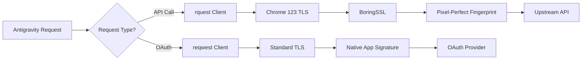

Antigravity Manager uses advanced TLS fingerprinting to emulate a real Chrome browser, bypassing anti-bot systems and CAPTCHAs that would otherwise block automated requests.

## What is JA3 Fingerprinting?

**JA3** is a TLS fingerprinting method that creates a unique signature based on:

- TLS version
- Accepted ciphers
- List of extensions
- Elliptic curves
- Elliptic curve formats

Servers use JA3 fingerprints to detect and block automated clients (bots) that don't match real browser signatures.

## Why Browser Emulation Matters

Standard HTTP libraries like `reqwest` have TLS signatures that differ from real browsers, causing:

- **403 Forbidden errors** - Server rejects non-browser traffic
- **CAPTCHA challenges** - Anti-bot systems trigger verification
- **Rate limiting** - Automated traffic gets stricter limits
- **Account flagging** - Repeated bot-like requests risk account bans

## rquest Library Implementation

Antigravity uses the **`rquest`** library with BoringSSL to achieve pixel-perfect Chrome emulation:

```toml
# Cargo.toml
[dependencies]
rquest = { version = "5.1.0", features = ["json", "stream", "socks", "cookies"] }
rquest-util = "2.2.1"
```

### Chrome 123 Fingerprint

The system emulates **Chrome 123** with specific version details:

```rust
// src-tauri/src/constants.rs

/// Known stable configuration (Chrome 123)
const KNOWN_STABLE_VERSION: &str = "4.1.27";
const KNOWN_STABLE_ELECTRON: &str = "39.2.3";
const KNOWN_STABLE_CHROME: &str = "132.0.6834.160";

pub static USER_AGENT: LazyLock<String> = LazyLock::new(|| {
    let platform_info = match std::env::consts::OS {
        "macos" => "Macintosh; Intel Mac OS X 10_15_7",
        "windows" => "Windows NT 10.0; Win64; x64",
        "linux" => "X11; Linux x86_64",
        _ => "X11; Linux x86_64",
    };

    format!(
        "Antigravity/{} ({}) Chrome/{} Electron/{}",
        config.version,
        platform_info,
        config.chrome,   // 132.0.6834.160
        config.electron  // 39.2.3
    )
});
```

### Dynamic Version Detection

The system intelligently selects the best version to emulate:

```rust
fn resolve_version_config() -> (VersionConfig, VersionSource) {
    let mut best_version = KNOWN_STABLE_VERSION.to_string();
    let mut source = VersionSource::KnownStableFallback;

    // 1. Try Local Installation
    if let Ok(local_ver) = get_antigravity_version() {
        if compare_semver(&local_ver, &best_version) > Ordering::Equal {
            best_version = local_ver;
            source = VersionSource::LocalInstallation;
        }
    }

    // 2. Try Remote Version (from update server)
    if let Some(remote_v) = try_fetch_remote_version() {
        if compare_semver(&remote_v, &best_version) > Ordering::Equal {
            best_version = remote_v;
            source = VersionSource::RemoteAPI;
        }
    }

    // Always use: max(Local, Remote, Known Stable)
    (VersionConfig { version: best_version, ... }, source)
}
```

This strategy ensures:
- **Never too old** - Minimum version meets API requirements
- **Environment-adaptive** - Uses actual installed version when newer
- **Fallback safe** - Works in Docker/headless without local detection

## Full Header Emulation

Beyond TLS fingerprints, Antigravity injects Chrome-specific headers:

```rust
// Request headers matching real Chrome behavior
headers.insert("X-Client-Name", "antigravity");
headers.insert("X-Client-Version", CURRENT_VERSION.as_str());
headers.insert("X-Machine-Id", &machine_id);
headers.insert("X-VSCode-SessionId", SESSION_ID.as_str());
headers.insert("User-Agent", USER_AGENT.as_str());
```

### Session Continuity

The system maintains consistent session identifiers:

```rust
/// Global Session ID (generated once per app launch)
pub static SESSION_ID: LazyLock<String> = LazyLock::new(|| {
    uuid::Uuid::new_v4().to_string()
});
```

This creates a believable session lifecycle that matches real browser behavior.

## OAuth-Specific Fingerprinting

For OAuth token exchange, a **pure fingerprint** is used (no Chrome emulation):

```rust
/// Native OAuth Authorization User-Agent
pub static NATIVE_OAUTH_USER_AGENT: LazyLock<String> = LazyLock::new(|| {
    format!("vscode/1.X.X (Antigravity/{})", CURRENT_VERSION.as_str())
});
```

**Why?** OAuth providers expect native application signatures, not browser fingerprints. Using Chrome JA3 during OAuth would raise red flags.

### Dual Client Architecture

```rust
// Standard client: Chrome 123 TLS fingerprint (for API calls)
let api_client = rquest::Client::builder()
    .impersonate(rquest::tls::Impersonate::Chrome123)
    .build()?;

// OAuth client: Standard TLS (for token exchange)
let oauth_client = reqwest::Client::builder()
    .user_agent(NATIVE_OAUTH_USER_AGENT.as_str())
    .build()?;
```

## Where Fingerprinting is Applied

The Chrome 123 fingerprint is used for:

✅ **Quota queries** - Fetching account usage stats  
✅ **Chat completions** - Model inference requests  
✅ **Image generation** - Imagen 3 API calls  
✅ **Project resolution** - Fetching project IDs  
✅ **Model listings** - Discovering available models

❌ **NOT used for:**
- OAuth authorization
- Token refresh (uses `NATIVE_OAUTH_USER_AGENT`)
- Local filesystem operations

## Benefits

### 1. Bypass 403 Errors

Without fingerprinting:
```
HTTP/1.1 403 Forbidden
X-Reason: Automated traffic detected
```

With Chrome 123 emulation:
```
HTTP/1.1 200 OK
Content-Type: application/json
```

### 2. Avoid CAPTCHA Challenges

Servers are less likely to challenge traffic that looks like a legitimate Chrome browser.

### 3. Consistent Account Health

Reduces account flagging risk by maintaining browser-like request patterns.

### 4. Higher Rate Limits

Some services provide higher rate limits to verified browser traffic.

## Technical Architecture



## Version Sync Strategy

### Local Detection (macOS Example)

```rust
// Reads actual installed version from:
// /Applications/Antigravity Tools.app/Contents/Info.plist
if let Ok(local_ver) = get_antigravity_version() {
    // Use real version for maximum authenticity
}
```

### Remote Fallback

```rust
const VERSION_URL: &str = 
    "https://antigravity-auto-updater.us-central1.run.app";

fn try_fetch_remote_version() -> Option<String> {
    let client = reqwest::blocking::Client::builder()
        .timeout(Duration::from_secs(5))
        .build()?;
    
    let resp = client.get(VERSION_URL).send()?;
    parse_version(&resp.text()?)
}
```

### Static Floor

If both detection methods fail (Docker, headless server):

```rust
const KNOWN_STABLE_VERSION: &str = "4.1.27";
// Always >= minimum API requirements
```

## Changelog Highlights

### v4.1.23 (2026-02-25)

> **[Security Enhancement]** Optimize and align application layer and underlying feature fingerprints with native behavior, improving request stability and anti-blocking capabilities.

### v4.1.18 (2026-02-14)

> **[Core Upgrade]** JA3 fingerprinting (Chrome 123) fully implemented:
> - **Anti-crawler breakthrough**: Integrated `rquest` core library with BoringSSL, achieving pixel-level replication of Chrome 123 TLS fingerprint (JA3/JA4)
> - **Global coverage**: Fingerprinting applied to all outbound traffic from quota queries to conversation completion

### v4.1.20 (2026-02-16)

> **[Core Optimization]** Ultimate realistic request camouflage:
> - **Dynamic version camouflage**: Intelligent version detection mechanism - automatically reads locally installed real version numbers to build User-Agent
> - **Docker environment fallback**: Built-in "known stable version" fingerprint library for headless mode
> - **Full-dimensional header injection**: Complete `X-Client-Name`, `X-Client-Version`, `X-Machine-Id` headers

## Best Practices

1. **Keep Antigravity Updated** - Newer versions match latest Chrome releases
2. **Don't Override User-Agent** - System-generated UA is carefully crafted
3. **Enable Auto-Update** - Ensures fingerprint stays current
4. **Monitor Version Logs** - Check which fingerprint version is active

## Troubleshooting

### Issue: Still getting 403 errors

**Check fingerprint version:**
```bash
# View logs to confirm version being used
tail -f ~/.antigravity_tools/logs/proxy.log | grep "User-Agent initialized"
```

**Expected output:**
```
User-Agent initialized version=4.1.27 source=LocalInstallation
```

### Issue: OAuth fails with "invalid client"

**Cause:** OAuth using wrong User-Agent (Chrome instead of native).

**Verification:** Check that `exchange_code` uses `NATIVE_OAUTH_USER_AGENT`, not `USER_AGENT`.

### Issue: Version stuck at 4.1.27 despite newer install

**Cause:** Local detection failed.

**Debug:**
```rust
tracing::info!("Local version detection result: {:?}", 
    get_antigravity_version());
```

## Related

- [Self-Healing Mechanisms](/architecture/self-healing) - Automatic retry when fingerprint is detected
- [Smart Routing](/architecture/smart-routing) - Account selection after successful authentication
