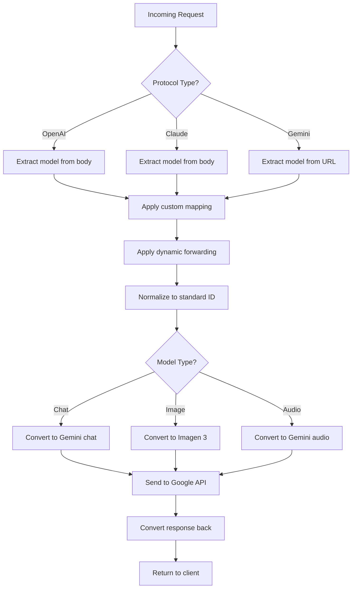

## Overview

The **Model Router** is responsible for transforming incoming model requests from various API formats (OpenAI, Anthropic, Gemini) into the appropriate upstream format and vice versa.

## Key Responsibilities

1. **Model ID Mapping** - Transform client model IDs to upstream IDs
2. **Protocol Conversion** - Convert request/response between formats
3. **Dynamic Forwarding** - Route deprecated models to new ones
4. **Parameter Adaptation** - Adjust parameters for upstream compatibility

## Model Mapping System

**Location:** `src-tauri/src/proxy/common/model_mapping.rs`

### Standard ID Normalization

```rust
pub fn normalize_to_standard_id(model_name: &str) -> Option<String> {
    // Remove suffixes like -thinking, -high, -low
    let clean_name = model_name
        .trim_end_matches("-thinking")
        .trim_end_matches("-high")
        .trim_end_matches("-low")
        .to_lowercase();
    
    // Map to standard ID
    match clean_name.as_str() {
        "claude-sonnet-4-6" | "claude-sonnet-4.6" => Some("claude-sonnet-4-6"),
        "claude-opus-4-6" | "claude-opus-4.6" => Some("claude-opus-4-6"),
        "gemini-3.1-pro" | "gemini-pro-high" => Some("gemini-3.1-pro"),
        "gemini-3.1-flash" | "gemini-flash-high" => Some("gemini-3.1-flash"),
        "gemini-3-pro-image" => Some("gemini-3-pro-image"),
        _ => None,
    }
}
```

### Custom Mapping

Users can define custom model ID mappings in the configuration:

```rust
pub struct AppState {
    pub custom_mapping: Arc<RwLock<HashMap<String, String>>>,
}

pub async fn apply_model_mapping(
    model: String,
    state: &AppState,
) -> String {
    let mapping = state.custom_mapping.read().await;
    
    mapping.get(&model)
        .cloned()
        .unwrap_or(model)
}
```

**Example Configuration:**

```json
{
  "custom_mapping": {
    "gpt-4": "gemini-3.1-pro",
    "gpt-4-turbo": "gemini-3.1-pro-high",
    "claude-opus": "claude-opus-4-6"
  }
}
```

### Dynamic Forwarding Rules

**Purpose:** Automatically redirect deprecated models to new ones

**Location:** `src-tauri/src/proxy/token_manager.rs:511`

```rust
// Load forwarding rules from account quota data
if let Some(rules) = account["quota"]["model_forwarding_rules"].as_object() {
    for (old_model, new_model) in rules {
        update_dynamic_forwarding_rules(
            old_model.to_string(),
            new_model.as_str().unwrap().to_string(),
        );
    }
}
```

**Global Forwarding Table:**

```rust
static DYNAMIC_FORWARDING_RULES: OnceLock<RwLock<HashMap<String, String>>> = OnceLock::new();

pub fn update_dynamic_forwarding_rules(old_model: String, new_model: String) {
    let rules = DYNAMIC_FORWARDING_RULES.get_or_init(|| RwLock::new(HashMap::new()));
    rules.write().unwrap().insert(old_model, new_model);
}

pub fn apply_forwarding_rules(model: &str) -> String {
    let rules = DYNAMIC_FORWARDING_RULES.get_or_init(|| RwLock::new(HashMap::new()));
    rules.read().unwrap()
        .get(model)
        .cloned()
        .unwrap_or_else(|| model.to_string())
}
```

## Protocol Conversion

### Request Flow

```
Client Request (OpenAI/Claude/Gemini)
  → Model Mapping
    → Custom Mapping
      → Dynamic Forwarding
        → Protocol Conversion
          → Upstream Request (Google/Anthropic API)
```

### OpenAI → Gemini Conversion

**Location:** `src-tauri/src/proxy/handlers/openai.rs`

```rust
pub fn convert_openai_to_gemini(
    request: OpenAIChatRequest,
    target_model: &str,
) -> Result<GeminiRequest, AppError> {
    // 1. Convert messages
    let contents = request.messages.iter()
        .map(|msg| GeminiContent {
            role: match msg.role.as_str() {
                "system" => "user",  // Gemini doesn't have system role
                "assistant" => "model",
                "user" => "user",
                _ => "user",
            },
            parts: convert_message_content(&msg.content),
        })
        .collect();
    
    // 2. Handle system messages
    let system_instruction = request.messages.iter()
        .find(|m| m.role == "system")
        .map(|m| m.content.clone());
    
    // 3. Convert generation config
    let generation_config = GeminiGenerationConfig {
        temperature: request.temperature,
        max_output_tokens: request.max_tokens,
        top_p: request.top_p,
        top_k: request.top_k,
        stop_sequences: request.stop,
        response_mime_type: request.response_format
            .and_then(|f| if f.type_ == "json_object" {
                Some("application/json")
            } else { None }),
    };
    
    // 4. Convert tools (function calling)
    let tools = request.tools.map(|tools| {
        tools.into_iter().map(convert_openai_tool_to_gemini).collect()
    });
    
    Ok(GeminiRequest {
        contents,
        system_instruction,
        generation_config: Some(generation_config),
        tools,
        safety_settings: None,
    })
}
```

### Gemini → OpenAI Conversion

```rust
pub fn convert_gemini_to_openai(
    response: GeminiResponse,
    model: &str,
) -> Result<OpenAIResponse, AppError> {
    let candidate = response.candidates
        .first()
        .ok_or(AppError::InvalidResponse("No candidates"))?;
    
    let content = candidate.content.parts.iter()
        .filter_map(|part| part.text.clone())
        .collect::<Vec<_>>()
        .join("");
    
    // Extract tool calls
    let tool_calls = candidate.content.parts.iter()
        .filter_map(|part| part.function_call.as_ref())
        .enumerate()
        .map(|(i, fc)| OpenAIToolCall {
            id: format!("call_{}", i),
            type_: "function".to_string(),
            function: OpenAIFunction {
                name: fc.name.clone(),
                arguments: serde_json::to_string(&fc.args).unwrap(),
            },
        })
        .collect::<Vec<_>>();
    
    // Calculate token usage
    let usage = OpenAIUsage {
        prompt_tokens: response.usage_metadata.prompt_token_count,
        completion_tokens: response.usage_metadata.candidates_token_count,
        total_tokens: response.usage_metadata.total_token_count,
    };
    
    Ok(OpenAIResponse {
        id: format!("chatcmpl-{}", uuid::Uuid::new_v4()),
        object: "chat.completion".to_string(),
        created: chrono::Utc::now().timestamp(),
        model: model.to_string(),
        choices: vec![OpenAIChoice {
            index: 0,
            message: OpenAIMessage {
                role: "assistant".to_string(),
                content: if content.is_empty() { None } else { Some(content) },
                tool_calls: if tool_calls.is_empty() { None } else { Some(tool_calls) },
            },
            finish_reason: map_finish_reason(&candidate.finish_reason),
        }],
        usage: Some(usage),
    })
}
```

### Claude → Gemini Conversion

**Location:** `src-tauri/src/proxy/handlers/claude.rs`

```rust
pub fn convert_claude_to_gemini(
    request: ClaudeRequest,
    target_model: &str,
) -> Result<GeminiRequest, AppError> {
    // 1. Extract system message
    let system_instruction = if let Some(system) = request.system {
        Some(system)
    } else {
        None
    };
    
    // 2. Convert messages
    let contents = request.messages.iter()
        .map(|msg| GeminiContent {
            role: if msg.role == "user" { "user" } else { "model" },
            parts: match &msg.content {
                ClaudeContent::Text(text) => vec![GeminiPart::text(text)],
                ClaudeContent::Array(parts) => parts.iter()
                    .map(convert_claude_content_block)
                    .collect(),
            },
        })
        .collect();
    
    // 3. Handle thinking mode
    let thinking_config = if target_model.contains("thinking") {
        Some(GeminiThinkingConfig {
            thinking_budget: request.thinking
                .and_then(|t| t.budget_tokens)
                .unwrap_or(24576),
        })
    } else {
        None
    };
    
    // 4. Generation config
    let generation_config = GeminiGenerationConfig {
        temperature: request.temperature,
        max_output_tokens: request.max_tokens,
        top_p: request.top_p,
        top_k: request.top_k,
        stop_sequences: request.stop_sequences,
        thinking_config,
    };
    
    Ok(GeminiRequest {
        contents,
        system_instruction,
        generation_config: Some(generation_config),
        tools: request.tools.map(convert_claude_tools),
        safety_settings: None,
    })
}
```

## Streaming Response Handling

### SSE Stream Conversion

**OpenAI Streaming:**

```rust
pub async fn stream_gemini_to_openai(
    gemini_stream: impl Stream<Item = Result<GeminiChunk, Error>>,
    model: String,
) -> impl Stream<Item = Result<Bytes, Error>> {
    let stream_id = format!("chatcmpl-{}", uuid::Uuid::new_v4());
    
    gemini_stream.map(move |chunk| {
        let chunk = chunk?;
        
        // Convert chunk to OpenAI format
        let openai_chunk = OpenAIStreamChunk {
            id: stream_id.clone(),
            object: "chat.completion.chunk".to_string(),
            created: chrono::Utc::now().timestamp(),
            model: model.clone(),
            choices: vec![OpenAIStreamChoice {
                index: 0,
                delta: OpenAIDelta {
                    role: Some("assistant".to_string()),
                    content: extract_text_from_chunk(&chunk),
                    tool_calls: extract_tool_calls_from_chunk(&chunk),
                },
                finish_reason: chunk.candidates
                    .first()
                    .and_then(|c| c.finish_reason.as_ref())
                    .map(map_finish_reason),
            }],
        };
        
        // Format as SSE
        let json = serde_json::to_string(&openai_chunk)?;
        Ok(Bytes::from(format!("data: {}\n\n", json)))
    })
}
```

## Image Generation Model Routing

### Size and Quality Mapping

**Location:** `src-tauri/src/proxy/handlers/openai.rs`

```rust
pub fn map_image_generation_params(
    size: Option<String>,
    quality: Option<String>,
) -> (String, String) {
    // Parse size (e.g., "1920x1080" → "16:9")
    let aspect_ratio = if let Some(size_str) = size {
        if let Some((w, h)) = parse_dimensions(&size_str) {
            calculate_aspect_ratio(w, h)
        } else {
            "1:1".to_string()  // Default
        }
    } else {
        "1:1".to_string()
    };
    
    // Map quality to resolution
    let resolution = match quality.as_deref() {
        Some("hd") => "4K",
        Some("medium") => "2K",
        _ => "1K",  // standard
    };
    
    (aspect_ratio, resolution.to_string())
}

fn calculate_aspect_ratio(width: u32, height: u32) -> String {
    let ratio = width as f64 / height as f64;
    
    match () {
        _ if (ratio - 21.0/9.0).abs() < 0.1 => "21:9",
        _ if (ratio - 16.0/9.0).abs() < 0.1 => "16:9",
        _ if (ratio - 9.0/16.0).abs() < 0.1 => "9:16",
        _ if (ratio - 4.0/3.0).abs() < 0.1 => "4:3",
        _ if (ratio - 3.0/4.0).abs() < 0.1 => "3:4",
        _ => "1:1",
    }.to_string()
}
```

### Model Suffix Parsing

```rust
pub fn parse_image_model_suffix(model: &str) -> (Option<String>, Option<String>) {
    // Example: "gemini-3-pro-image-16-9-4k" → ("16:9", "4K")
    
    let parts: Vec<&str> = model.split('-').collect();
    let mut aspect_ratio = None;
    let mut resolution = None;
    
    // Look for aspect ratio (e.g., "16-9")
    for i in 0..parts.len()-1 {
        if let (Ok(w), Ok(h)) = (parts[i].parse::<u32>(), parts[i+1].parse::<u32>()) {
            aspect_ratio = Some(format!("{}:{}", w, h));
        }
    }
    
    // Look for resolution (e.g., "4k")
    if let Some(last) = parts.last() {
        if last.to_lowercase().ends_with('k') {
            resolution = Some(last.to_uppercase());
        }
    }
    
    (aspect_ratio, resolution)
}
```

## Parameter Adaptation

### Thinking Mode Conversion

**Anthropic Thinking Level → Gemini Budget:**

```rust
pub fn convert_thinking_level_to_budget(level: &str) -> Option<i64> {
    match level.to_uppercase().as_str() {
        "NONE" => Some(0),
        "LOW" => Some(4096),
        "MEDIUM" => Some(8192),
        "HIGH" => Some(24576),
        _ => None,
    }
}
```

### Token Limit Enforcement

**Location:** `src-tauri/src/proxy/token_manager.rs:500`

```rust
// Extract model-specific limits from quota data
if let Some(limit) = model.get("max_output_tokens").and_then(|v| v.as_u64()) {
    model_limits.insert(name.to_string(), limit);
}
```

**Clamping at request time:**

```rust
let max_allowed = token.model_limits
    .get(&normalized_model)
    .copied()
    .unwrap_or(131072);  // Default

if request.max_tokens > max_allowed {
    request.max_tokens = max_allowed;
    tracing::warn!("Clamped max_tokens to {}", max_allowed);
}
```

## Request Routing Decision Tree



## Error Handling

### Model Not Found

```rust
if !is_valid_model(target_model) {
    return Err(AppError::InvalidModel {
        model: target_model.to_string(),
        suggestion: suggest_similar_model(target_model),
    });
}
```

### Fallback Chain

```rust
let final_model = custom_mapping.get(&requested_model)
    .or_else(|| forwarding_rules.get(&requested_model))
    .or_else(|| normalize_to_standard_id(&requested_model))
    .unwrap_or_else(|| requested_model.clone());
```

## Summary

The Model Router provides:

- **Multi-protocol support** - OpenAI, Anthropic, Gemini
- **Flexible mapping** - Custom + dynamic forwarding
- **Protocol conversion** - Bidirectional transformation
- **Parameter adaptation** - Enforce model-specific limits
- **Streaming support** - SSE conversion for all protocols

**Related Documentation:**

- [System Overview](/architecture/overview) - Full architecture
- [Proxy Server](/architecture/proxy-server) - HTTP server layer
- [Token Manager](/architecture/token-manager) - Account selection
