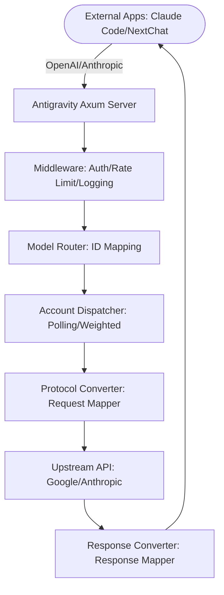

## Architecture Overview

Antigravity Manager is a desktop application that transforms web-based AI sessions (Google/Anthropic) into standardized API endpoints. Built with modern technologies, it provides a robust, high-performance AI request proxy system.

## Technology Stack

### Frontend
- **React** - Modern UI framework
- **Tauri v2** - Cross-platform desktop framework
- **TypeScript** - Type-safe application logic

### Backend
- **Rust** - High-performance, memory-safe system programming
- **Tokio** - Asynchronous runtime for concurrent request handling
- **Axum** - Fast, ergonomic web framework for proxy server

### Key Dependencies

```toml
# Core Framework
tauri = "^2.2.5"

# HTTP Server & Proxy
axum = "0.7"
reqwest = "0.12"          # Standard HTTP client
rquest = "5.1.0"           # JA3 fingerprint-spoofing client

# Async Runtime
tokio = { version = "1", features = ["full"] }
tokio-stream = "0.1.17"

# HTTP/2 & Utilities
hyper = "1"
hyper-util = "0.1"
tower = "0.4"
tower-http = "0.5"

# Concurrency & State
dashmap = "6.1"            # Lock-free concurrent hashmap
parking_lot = "0.12.5"    # Faster mutex/rwlock

# Database
rusqlite = "0.32"         # SQLite for logs & stats
```

## System Architecture Diagram



## Core Components

### 1. Tauri Application (`src-tauri/src/lib.rs`)

The main application entry point that:
- Initializes the Tauri runtime
- Manages application lifecycle
- Coordinates between frontend and backend
- Handles headless mode for Docker/server deployments

**Key Responsibilities:**
- Logger initialization
- Database setup (token stats, security, user tokens)
- Tray icon management
- Auto-start configuration
- Background task scheduling

### 2. Axum Proxy Server (`src-tauri/src/proxy/server.rs`)

A high-performance HTTP server that:
- Listens on configurable port (default: 8045)
- Handles multiple protocol formats (OpenAI, Anthropic, Gemini)
- Manages authentication and rate limiting
- Provides admin API for management

**Server Architecture:**
```rust
pub struct AppState {
    pub token_manager: Arc<TokenManager>,
    pub custom_mapping: Arc<RwLock<HashMap<String, String>>>,
    pub upstream: Arc<UpstreamClient>,
    pub security: Arc<RwLock<ProxySecurityConfig>>,
    pub monitor: Arc<ProxyMonitor>,
    pub integration: SystemManager,
    pub account_service: Arc<AccountService>,
    // ... more state
}
```

### 3. Token Manager (`src-tauri/src/proxy/token_manager.rs`)

Central account and token management system:
- Loads accounts from disk (`~/.antigravity_tools/accounts/`)
- Manages access/refresh token lifecycle
- Implements intelligent account selection algorithms
- Handles quota protection and rate limiting

**Token Selection Strategy:**
1. **Capability Filtering** - Only accounts with the target model
2. **Tier Priority** - Ultra > Pro > Free
3. **Quota Sorting** - Higher remaining quota first
4. **Health Score** - Account reliability tracking
5. **P2C Algorithm** - Power of 2 Choices for load balancing

### 4. Model Router

Maps incoming model requests to appropriate upstream models:
- Custom model ID mapping
- Protocol-specific transformations
- Dynamic model forwarding rules
- Fallback handling for deprecated models

## Request Flow

1. **Client Request** → Client sends OpenAI/Anthropic/Gemini API request
2. **Authentication** → API key validation (middleware)
3. **IP Filtering** → Whitelist/blacklist check (middleware)
4. **Model Mapping** → Transform model ID to target model
5. **Account Selection** → TokenManager chooses best account
6. **Protocol Conversion** → Transform request to upstream format
7. **Upstream Request** → Send to Google/Anthropic API
8. **Response Mapping** → Convert response to client format
9. **Monitoring** → Log request metrics and statistics

## Deployment Modes

### Desktop Mode (GUI)
- Full Tauri application with React frontend
- Tray icon integration
- Auto-start on system boot
- Local management interface

### Headless Mode (Docker/Server)
- CLI-only operation with `--headless` flag
- Web UI served from `/dist` directory
- Environment variable configuration
- Systemd/Docker container support

**Headless Activation:**
```bash
# Manual
./antigravity-tools --headless

# Docker
docker run -p 8045:8045 \
  -e API_KEY=sk-your-key \
  -e WEB_PASSWORD=admin-pwd \
  lbjlaq/antigravity-manager:latest
```

## Data Storage

### File System Structure
```
~/.antigravity_tools/
├── accounts/              # Account JSON files
│   ├── {uuid}.json       # Individual account data
│   └── index.json        # Account index
├── logs/                 # Application logs
├── token_stats.db        # SQLite: token usage statistics
├── security.db           # SQLite: IP access logs
├── user_tokens.db        # SQLite: user token management
└── gui_config.json       # Application configuration
```

### Databases

- **token_stats.db** - Request metrics, token usage, model trends
- **security.db** - IP access logs, blacklist/whitelist
- **user_tokens.db** - Multi-user token management

## Security Features

1. **Authentication Modes**
   - `Off` - No authentication
   - `Auto` - Auth for non-health endpoints
   - `AllExceptHealth` - Auth required except `/health`
   - `Strict` - Auth required for all endpoints

2. **IP Filtering**
   - Whitelist/blacklist support
   - Per-request logging
   - Geographic access control

3. **Rate Limiting**
   - Per-account rate limits
   - Automatic cooldown handling
   - 429 error auto-retry with account rotation

4. **Token Isolation**
   - Separate admin and API keys
   - Multi-user token system
   - Session-based account binding

## Performance Optimizations

### Concurrency
- **Tokio async runtime** - Handle thousands of concurrent requests
- **DashMap** - Lock-free concurrent hashmap for token pool
- **Parking Lot** - Fast RwLock for shared state

### Caching
- **In-memory quota cache** - Avoid disk reads during selection
- **Model limits cache** - Pre-load max_output_tokens
- **Project ID caching** - Reduce upstream API calls

### Request Optimization
- **HTTP/2 connection pooling** - Reuse connections
- **JA3 fingerprint spoofing** - Bypass bot detection (rquest)
- **Streaming responses** - Low-latency SSE forwarding

## Monitoring & Observability

- **Structured logging** - Tracing with log levels
- **Request metrics** - Token usage, latency, error rates
- **Health checks** - `/health` and `/healthz` endpoints
- **Admin dashboard** - Real-time stats and logs

## Next Steps

- [Proxy Server Architecture](/architecture/proxy-server) - Deep dive into Axum server
- [Token Manager](/architecture/token-manager) - Account management system
- [Model Router](/architecture/model-router) - Request routing logic
