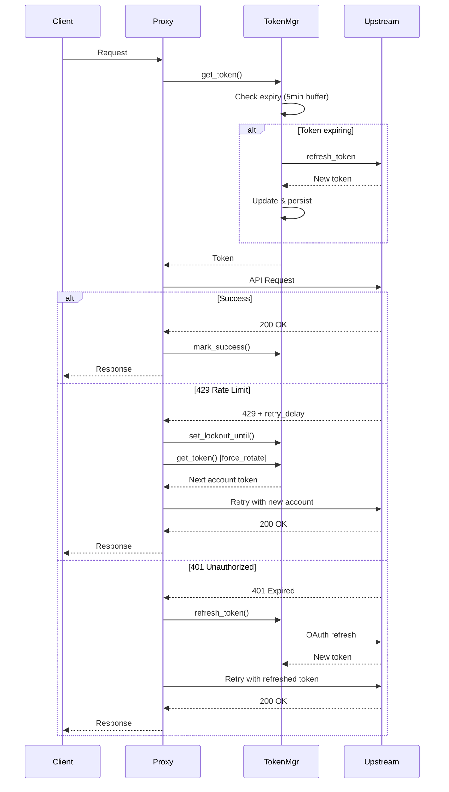

Antigravity Manager implements comprehensive self-healing mechanisms that automatically recover from transient failures, ensuring uninterrupted service during rate limits and authentication issues.

## Overview

The self-healing system handles:

- **429 Too Many Requests** - Quota exhaustion and rate limiting
- **401 Unauthorized** - Expired tokens and authentication failures
- **5xx Server Errors** - Upstream service disruptions
- **Network Timeouts** - Transient connectivity issues

## Rate Limit Detection & Recovery

### 429 Error Handling

When a 429 error occurs, the system:

1. **Parses retry delay** from error response
2. **Locks the account** until quota resets
3. **Rotates to next account** immediately
4. **Retries the request** seamlessly

```rust
// Parse retry delay from Google API error response
pub fn parse_retry_delay(error_text: &str) -> Option<u64> {
    let json: Value = serde_json::from_str(error_text).ok()?;
    let details = json.get("error")?.get("details")?.as_array()?;

    // Method 1: RetryInfo.retryDelay
    for detail in details {
        if let Some(type_str) = detail.get("@type")?.as_str() {
            if type_str.contains("RetryInfo") {
                if let Some(retry_delay) = detail.get("retryDelay")?.as_str() {
                    return parse_duration_ms(retry_delay);
                }
            }
        }
    }

    // Method 2: metadata.quotaResetDelay
    for detail in details {
        if let Some(quota_delay) = detail
            .get("metadata")
            .and_then(|m| m.get("quotaResetDelay"))
            .and_then(|v| v.as_str())
        {
            return parse_duration_ms(quota_delay);
        }
    }

    None
}
```

### Duration Parsing

Supports Google's duration format (e.g., `1h16m0.667s`):

```rust
pub fn parse_duration_ms(duration_str: &str) -> Option<u64> {
    let mut total_ms: f64 = 0.0;
    
    for cap in DURATION_RE.captures_iter(duration_str) {
        let value: f64 = cap[1].parse().ok()?;
        let unit = &cap[2];

        match unit {
            "ms" => total_ms += value,
            "s" => total_ms += value * 1000.0,
            "m" => total_ms += value * 60.0 * 1000.0,
            "h" => total_ms += value * 60.0 * 60.0 * 1000.0,
            _ => {}
        }
    }

    Some(total_ms.round() as u64)
}
```

**Example:** `"1h16m0.667s"` → `4560667` milliseconds

## Rate Limit Tracking

### Account Lockout

When an account hits rate limits, it's temporarily locked:

```rust
pub struct RateLimitInfo {
    /// Lockout expiration time
    pub reset_time: SystemTime,
    
    /// Retry interval (seconds)
    pub retry_after_sec: u64,
    
    /// Detection timestamp
    pub detected_at: SystemTime,
    
    /// Reason for rate limit
    pub reason: RateLimitReason,
    
    /// Affected model (None = account-level)
    pub model: Option<String>,
}

pub enum RateLimitReason {
    QuotaExhausted,           // QUOTA_EXHAUSTED
    RateLimitExceeded,        // RATE_LIMIT_EXCEEDED
    ModelCapacityExhausted,   // MODEL_CAPACITY_EXHAUSTED
    ServerError,              // 5xx errors
    Unknown,
}
```

### Model-Level Rate Limiting

Rate limits can be applied per-model or per-account:

```rust
/// Generate rate limit key
fn get_limit_key(&self, account_id: &str, model: Option<&str>) -> String {
    match model {
        Some(m) if !m.is_empty() => format!("{}:{}", account_id, m),
        _ => account_id.to_string(),
    }
}

/// Set lockout until specific time
pub fn set_lockout_until(
    &self,
    account_id: &str,
    reset_time: SystemTime,
    reason: RateLimitReason,
    model: Option<String>,
) {
    let key = self.get_limit_key(account_id, model.as_deref());
    let info = RateLimitInfo { reset_time, reason, model, ... };
    
    self.limits.insert(key, info);
    
    if let Some(m) = &model {
        tracing::info!(
            "Account {} model {} locked for {} seconds",
            account_id, m, retry_after_sec
        );
    }
}
```

This enables:
- **Account-level lockout** - Block all requests from account
- **Model-level lockout** - Block only specific model, allow others

### Intelligent Backoff

The system uses **exponential backoff** with failure count tracking:

```rust
/// Failure count expiry: 1 hour
const FAILURE_COUNT_EXPIRY_SECONDS: u64 = 3600;

pub struct RateLimitTracker {
    limits: DashMap<String, RateLimitInfo>,
    
    /// Consecutive failure counts (with expiry timestamp)
    failure_counts: DashMap<String, (u32, SystemTime)>,
}

/// Calculate backoff duration based on failure count
fn calculate_backoff(&self, account_id: &str) -> u64 {
    let (count, timestamp) = self.failure_counts
        .get(account_id)
        .map(|v| *v.value())
        .unwrap_or((0, SystemTime::now()));
    
    // Expire count after 1 hour
    if timestamp.elapsed().unwrap_or_default() > Duration::from_secs(3600) {
        return 60; // Minimum 60s
    }
    
    // Exponential: 60s, 120s, 240s, 480s, max 900s (15min)
    (60 * 2_u64.pow(count)).min(900)
}
```

### Success Reset

Successful requests reset the failure counter:

```rust
pub fn mark_success(&self, account_id: &str) {
    if self.failure_counts.remove(account_id).is_some() {
        tracing::debug!("Account {} success, failure count reset", account_id);
    }
    
    // Clear account-level rate limit
    self.limits.remove(account_id);
}
```

## Token Refresh (401 Recovery)

### Automatic Token Renewal

When a 401 error occurs, tokens are automatically refreshed:

```rust
// Check if token is about to expire (5 min buffer)
let now = chrono::Utc::now().timestamp();
if now >= token.timestamp - 300 {
    tracing::debug!("Token expiring soon for {}, refreshing...", token.email);
    
    match refresh_access_token(&token.refresh_token, Some(&token.account_id)).await {
        Ok(token_response) => {
            // Update in-memory token
            token.access_token = token_response.access_token.clone();
            token.expires_in = token_response.expires_in;
            token.timestamp = now + token_response.expires_in;
            
            // Persist to disk
            self.save_refreshed_token(&token.account_id, &token_response).await?;
            
            tracing::info!("Token refreshed for {}", token.email);
        }
        Err(e) => {
            tracing::warn!("Token refresh failed for {}: {}", token.email, e);
            // Continue with old token, let retry logic handle it
        }
    }
}
```

### Preemptive Refresh

Tokens are refreshed **5 minutes before expiration** to avoid mid-request failures.

## Automatic Account Rotation

### Seamless Failover

When an account fails, the system automatically tries the next available account:

```rust
pub async fn get_token_with_retry(
    &self,
    quota_group: &str,
    session_id: Option<&str>,
    target_model: &str,
    max_attempts: usize,
) -> Result<ProxyToken, String> {
    let mut attempted = HashSet::new();
    
    for attempt in 1..=max_attempts {
        match self.get_token(quota_group, false, session_id, target_model).await {
            Ok(token) => {
                // Check if account is rate-limited
                if self.is_rate_limited(&token.0, Some(target_model)).await {
                    tracing::warn!(
                        "Account {} is rate-limited, trying next (attempt {}/{})",
                        token.0, attempt, max_attempts
                    );
                    
                    attempted.insert(token.0.clone());
                    continue;
                }
                
                return Ok(token);
            }
            Err(e) if attempt < max_attempts => {
                tracing::warn!("Token retrieval failed (attempt {}/{}): {}", 
                    attempt, max_attempts, e);
                tokio::time::sleep(Duration::from_millis(100)).await;
            }
            Err(e) => return Err(e),
        }
    }
    
    Err("All retry attempts exhausted".to_string())
}
```

### Failure Isolation

The `attempted` set prevents retry loops:

```rust
let available: Vec<&ProxyToken> = candidates.iter()
    .filter(|t| !attempted.contains(&t.account_id))  // Skip failed accounts
    .filter(|t| !self.is_rate_limited(&t.account_id, Some(target_model)))
    .collect();
```

## Auto-Cleanup Background Task

Expired rate limit records are automatically cleaned:

```rust
pub async fn start_auto_cleanup(&self) {
    let tracker = self.rate_limit_tracker.clone();
    let cancel = self.cancel_token.child_token();

    tokio::spawn(async move {
        let mut interval = tokio::time::interval(Duration::from_secs(15));
        
        loop {
            tokio::select! {
                _ = cancel.cancelled() => break,
                _ = interval.tick() => {
                    let cleaned = tracker.cleanup_expired();
                    if cleaned > 0 {
                        tracing::info!("Auto-cleanup: Removed {} expired records", cleaned);
                    }
                }
            }
        }
    });
}

pub fn cleanup_expired(&self) -> usize {
    let now = SystemTime::now();
    let mut count = 0;
    
    self.limits.retain(|_, info| {
        if info.reset_time <= now {
            count += 1;
            false  // Remove expired
        } else {
            true   // Keep active
        }
    });
    
    count
}
```

Runs every **15 seconds** to prevent memory leaks.

## Graceful Shutdown

Background tasks are cleanly terminated on app exit:

```rust
pub async fn graceful_shutdown(&self, timeout: Duration) {
    tracing::info!("Initiating graceful shutdown...");
    
    // Send cancel signal
    self.cancel_token.cancel();
    
    // Wait for tasks to complete (with timeout)
    match tokio::time::timeout(timeout, self.abort_background_tasks()).await {
        Ok(_) => tracing::info!("Background tasks cleaned up"),
        Err(_) => tracing::warn!("Cleanup timed out, force-aborted"),
    }
}
```

## Request Flow with Self-Healing



## Configuration

### Retry Settings

```json
{
  "retry": {
    "max_attempts": 3,
    "initial_backoff_ms": 1000,
    "max_backoff_ms": 30000,
    "backoff_multiplier": 2.0
  }
}
```

### Rate Limit Settings

```json
{
  "rate_limit": {
    "enable_tracking": true,
    "cleanup_interval_sec": 15,
    "failure_count_expiry_sec": 3600,
    "min_backoff_sec": 60,
    "max_backoff_sec": 900
  }
}
```

## Monitoring

### Rate Limit Status

Check active rate limits via logs:

```bash
grep "locked for" ~/.antigravity_tools/logs/proxy.log
```

Example output:
```
2026-03-03 10:15:23 INFO Account user@example.com model gemini-3.1-pro locked for 120 seconds
```

### Failure Count Tracking

```bash
grep "failure count" ~/.antigravity_tools/logs/proxy.log
```

## Best Practices

1. **Use multiple accounts** - Enables seamless rotation during rate limits
2. **Enable auto-refresh** - Keeps quota data current for accurate lockouts
3. **Monitor failure patterns** - Identify problematic accounts or models
4. **Set reasonable retry limits** - Avoid overwhelming upstream with retries
5. **Review rate limit logs** - Understand quota consumption patterns

## Troubleshooting

### Issue: Requests fail even with multiple accounts

**Cause:** All accounts are rate-limited.

**Solution:** Check rate limit status:
```bash
curl http://localhost:8045/api/rate-limits/status
```

### Issue: Account stuck in rate-limited state

**Cause:** Cleanup task not running or reset time not reached.

**Solution:** Force cleanup:
```bash
curl -X POST http://localhost:8045/api/rate-limits/cleanup
```

### Issue: Token refresh fails repeatedly

**Cause:** Refresh token may be revoked.

**Solution:** Re-authorize the account via OAuth flow.

## Related

- [Smart Routing](/architecture/smart-routing) - How accounts are selected for retry
- [Quota Protection](/architecture/quota-protection) - Preventing rate limit triggers
- [JA3 Fingerprinting](/architecture/ja3-fingerprinting) - Reducing detection-based rate limits
