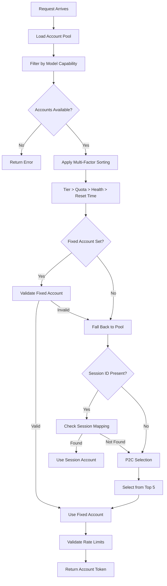

Antigravity Manager implements a sophisticated multi-tier routing system that intelligently selects accounts based on subscription level, quota availability, and health metrics.

## Tiered Account Prioritization

The system uses a **strict tier-based routing algorithm** that prioritizes accounts in the following order:

1. **Ultra** - Highest priority, fastest quota reset
2. **Pro** - Medium priority, standard quota reset  
3. **Free** - Lowest priority, slowest quota reset

### How It Works

When a request comes in, the routing system:

```rust
// Priority 0: Subscription tier sorting (ULTRA > PRO > FREE)
let tier_priority = |tier: &Option<String>| {
    let t = tier.as_deref().unwrap_or("").to_lowercase();
    if t.contains("ultra") { 0 }
    else if t.contains("pro") { 1 }
    else if t.contains("free") { 2 }
    else { 3 }
};
```

This ensures high-tier accounts with faster quota refresh cycles are consumed first, maintaining service availability during high-frequency usage.

## Multi-Factor Account Selection

Beyond subscription tiers, the system evaluates accounts using multiple criteria:

### 1. Capability Filtering

Before selection, accounts are filtered to ensure they support the requested model:

```rust
// Only retain accounts with explicit quota for the target model
tokens_snapshot.retain(|t| t.model_quotas.contains_key(&normalized_target));
```

This prevents routing requests to accounts that don't have access to premium models like Claude Opus 4.6.

### 2. Model-Specific Quota

Accounts are sorted by **target model quota** (not global quota):

```rust
// Priority 1: Target model's quota (higher is better)
let quota_a = a.model_quotas.get(&normalized_target).copied().unwrap_or(0);
let quota_b = b.model_quotas.get(&normalized_target).copied().unwrap_or(0);
```

This protects low-quota accounts from being exhausted prematurely.

### 3. Health Score

Each account maintains a health score (0.0 - 1.0) based on recent success/failure rates:

```rust
// Priority 2: Health score (higher is better)
let health_cmp = b.health_score.partial_cmp(&a.health_score)
    .unwrap_or(std::cmp::Ordering::Equal);
```

Accounts with recent errors are deprioritized automatically.

### 4. Quota Reset Time

Accounts with earlier reset times are prioritized if the difference exceeds 10 minutes:

```rust
const RESET_TIME_THRESHOLD_SECS: i64 = 600; // 10 minutes

// Priority 3: Reset time (earlier is better, if diff > 10 min)
let reset_a = a.reset_time.unwrap_or(i64::MAX);
let reset_b = b.reset_time.unwrap_or(i64::MAX);
if (reset_a - reset_b).abs() >= RESET_TIME_THRESHOLD_SECS {
    reset_a.cmp(&reset_b)
}
```

## Power of Two Choices (P2C) Algorithm

To prevent hot-spot formation (multiple requests hitting the same account), Antigravity uses the **P2C load balancing algorithm**:

```rust
const P2C_POOL_SIZE: usize = 5;

// Randomly select 2 accounts from top 5 candidates
let pick1 = rng.gen_range(0..pool_size);
let pick2 = rng.gen_range(0..pool_size);

// Choose the one with higher quota
let selected = if c1.remaining_quota >= c2.remaining_quota {
    c1
} else {
    c2
};
```

This approach:
- Prevents thundering herd on the highest-quota account
- Distributes load across top performers
- Maintains near-optimal performance

## Session Affinity (Sticky Sessions)

For multi-turn conversations, the system supports **session-based account pinning**:

```rust
// Map session ID to account ID for conversation continuity
session_accounts: Arc<DashMap<String, String>>
```

When a client provides a `session_id`, all requests in that session use the same account, ensuring:
- Consistent conversation context
- Reduced quota fragmentation
- Better user experience

## Fixed Account Mode

You can lock all requests to a specific account:

```rust
preferred_account_id: Arc<tokio::sync::RwLock<Option<String>>>
```

When set, the system:
1. Always attempts to use the preferred account first
2. Validates it's not disabled or rate-limited
3. Falls back to normal routing if unavailable

## Account State Validation

Before using an account, the system performs **disk state validation**:

```rust
async fn get_account_state_on_disk(account_path: &PathBuf) -> OnDiskAccountState {
    // Check disabled, proxy_disabled, or is_forbidden flags
    let disabled = account.get("disabled").unwrap_or(false)
        || account.get("proxy_disabled").unwrap_or(false)
        || account.get("quota").get("is_forbidden").unwrap_or(false);
}
```

This prevents using accounts that were disabled or marked forbidden between memory reloads.

## Routing Decision Flow



## Configuration

Routing behavior can be customized through:

- **Quota Protection Settings** - Set minimum thresholds per model
- **Sticky Session TTL** - Configure session lifetime
- **Fixed Account Mode** - Pin to a specific account
- **Health Score Thresholds** - Adjust failure sensitivity

## Best Practices

1. **Use Ultra/Pro accounts for production** - Free tier has slower quota refresh
2. **Enable session affinity for chat** - Improves multi-turn conversation quality
3. **Monitor account health** - Remove consistently failing accounts
4. **Distribute models across accounts** - Avoid putting all quota in one account
5. **Set quota protection thresholds** - Prevent complete exhaustion

## Related

- [Quota Protection](/architecture/quota-protection) - Learn about quota monitoring
- [Self-Healing Mechanisms](/architecture/self-healing) - Understand automatic recovery
