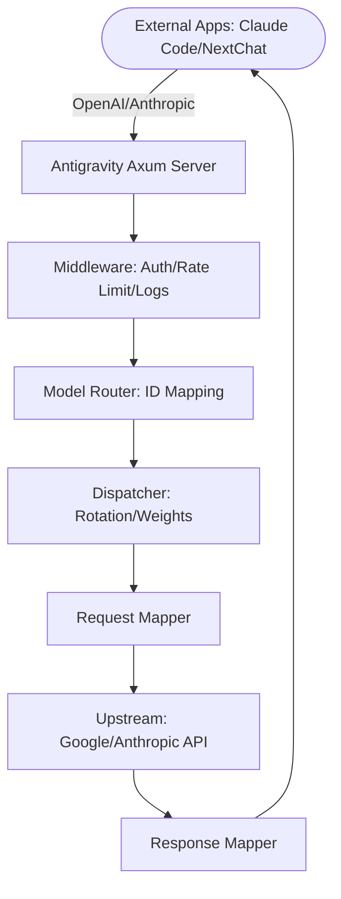

# Welcome to Antigravity Manager

Antigravity Manager is a professional AI account management and protocol proxy system built with Tauri v2, Rust, and React. It transforms your Google and Anthropic web sessions into standardized API interfaces, providing a stable, high-speed, and cost-effective local AI relay station.

## Why Antigravity Manager?

Antigravity Manager eliminates the protocol gap between different AI providers, allowing you to:

- **Unify Access**: Use a single API endpoint for multiple AI services
- **Smart Routing**: Automatically select the best available account based on quota
- **Multi-Protocol Support**: OpenAI, Anthropic, and Gemini formats all in one
- **Privacy First**: All processing happens locally on your machine

## Key Features

<CardGroup cols={2}>
  <Card title="Smart Account Dashboard" icon="gauge-high">
    Real-time monitoring of all account health, average remaining quotas, and intelligent best-account recommendations with one-click switching.
  </Card>
  
  <Card title="Professional Account Management" icon="users">
    OAuth 2.0 authorization (auto/manual), multi-dimensional import (Token, JSON, V1 migration), and 403 forbidden detection with automatic skipping.
  </Card>
  
  <Card title="Protocol Conversion & Relay" icon="arrows-rotate">
    OpenAI `/v1/chat/completions`, Anthropic `/v1/messages`, and native Gemini formats with smart self-healing on 429/401 errors.
  </Card>
  
  <Card title="Model Router Center" icon="route">
    Series-based mapping, expert-level redirection with regex, tiered routing by account type, and silent background downgrading.
  </Card>
  
  <Card title="Multimodal Support" icon="images">
    Advanced image generation with Imagen 3, supports up to 100MB payloads (configurable), and precise aspect ratio control.
  </Card>
  
  <Card title="JA3 Fingerprinting" icon="fingerprint">
    Chrome 123 TLS fingerprint emulation to bypass anti-bot protections and reduce 403 errors from upstream providers.
  </Card>
</CardGroup>

## Architecture Overview

Antigravity Manager uses a sophisticated request pipeline:

## Supported Platforms

<CardGroup cols={3}>
  <Card title="Linux" icon="linux">
    - x86_64 & aarch64
    - .deb (Debian/Ubuntu)
    - .rpm (Fedora/RHEL)
    - AppImage (Universal)
  </Card>
  
  <Card title="macOS" icon="apple">
    - Apple Silicon & Intel
    - Universal .dmg
    - Homebrew support
  </Card>
  
  <Card title="Windows" icon="windows">
    - x64
    - NSIS .exe installer
    - PowerShell script
  </Card>
</CardGroup>

## Quick Start Paths

<CardGroup cols={3}>
  <Card title="Installation" icon="download" href="/installation">
    Get Antigravity Manager installed on your system in minutes
  </Card>
  
  <Card title="Quick Start" icon="rocket" href="/quickstart">
    Make your first API call and integrate with popular tools
  </Card>
  
  <Card title="GitHub Repository" icon="github" href="https://github.com/lbjlaq/Antigravity-Manager">
    View source code, report issues, and contribute
  </Card>
</CardGroup>

## What's New in v4.1.27

<AccordionGroup>
  <Accordion title="Core Fixes & Optimizations">
    - **Proxy Config Initialization**: Fixed missing default fields (`global_system_prompt`, `proxy_pool`, `image_thinking_mode`)
    - **Tool Image Preservation**: Unconditionally retain image data in `tool_result` with automatic conversion to `inlineData`
    - **OpenCode Thinking Budget**: Full compatibility for both `budget_tokens` (snake_case) and `budgetTokens` (camelCase)
  </Accordion>
  
  <Accordion title="Smart Routing Improvements">
    - **Free Account Detection**: Resolved infinite retry loops when free accounts reach quota limits
    - **Project ID Injection**: Accurate quota perception with proper `{"project": project_id}` structure
    - **Dashboard Display**: Fixed Gemini image quota showing as 0 by including `gemini-3.1-flash-image`
  </Accordion>
  
  <Accordion title="Docker Enhancements">
    - **Namespace Update**: Default image now `lbjlaq/antigravity-manager`
    - **Environment Variables**: Added default value placeholders for flexible configuration via `.env` files
  </Accordion>
</AccordionGroup>

## Community & Support

<CardGroup cols={2}>
  <Card title="Documentation" icon="book" href="/installation">
    Comprehensive guides and API references
  </Card>
  
  <Card title="Telegram Channel" icon="telegram" href="https://t.me/antigravity_tools">
    Join our community for updates and support
  </Card>
  
  <Card title="GitHub Issues" icon="bug" href="https://github.com/lbjlaq/Antigravity-Manager/issues">
    Report bugs and request features
  </Card>
  
  <Card title="Sponsor" icon="heart" href="https://www.buymeacoffee.com/Ctrler">
    Support the project development
  </Card>
</CardGroup>

## Next Steps

<Steps>
  <Step title="Install Antigravity Manager">
    Choose your preferred installation method: terminal script, Homebrew, Docker, or manual download
    
    [Go to Installation Guide →](/installation)
  </Step>
  
  <Step title="Add Your First Account">
    Use OAuth 2.0 to securely connect your Google or Anthropic accounts
    
    [Go to Quick Start →](/quickstart)
  </Step>
  
  <Step title="Make Your First API Call">
    Test the integration with Claude Code CLI, Python, or your favorite AI tool
    
    [Go to Quick Start →](/quickstart)
  </Step>
</Steps>
